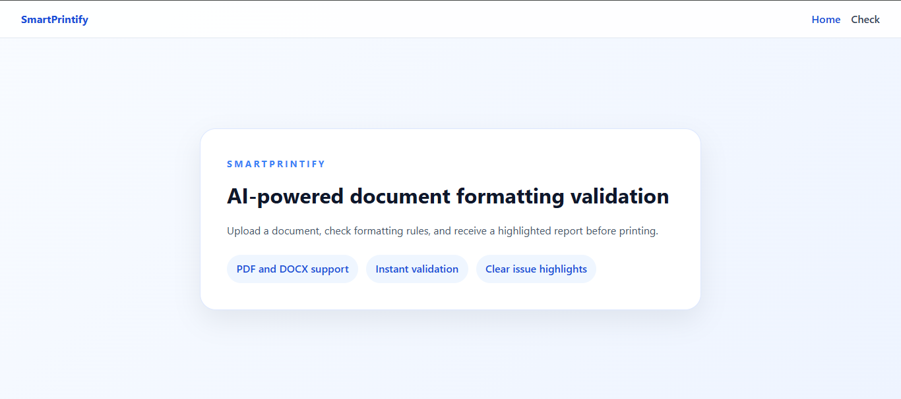
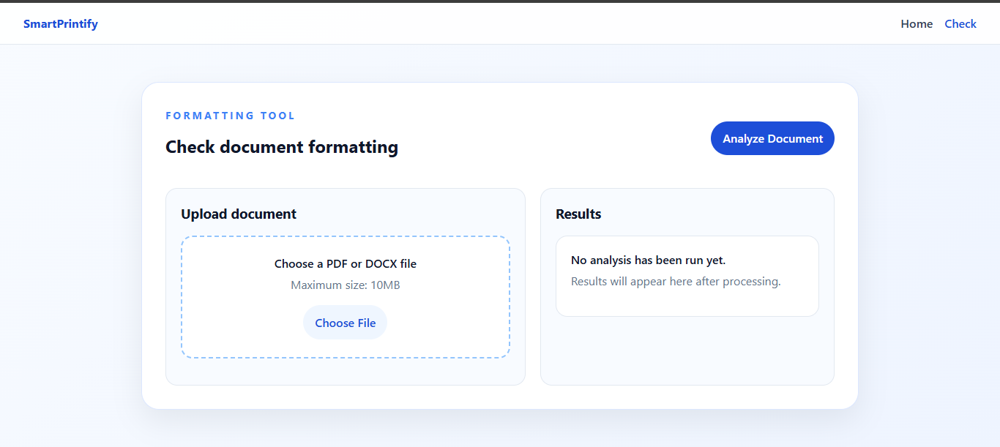
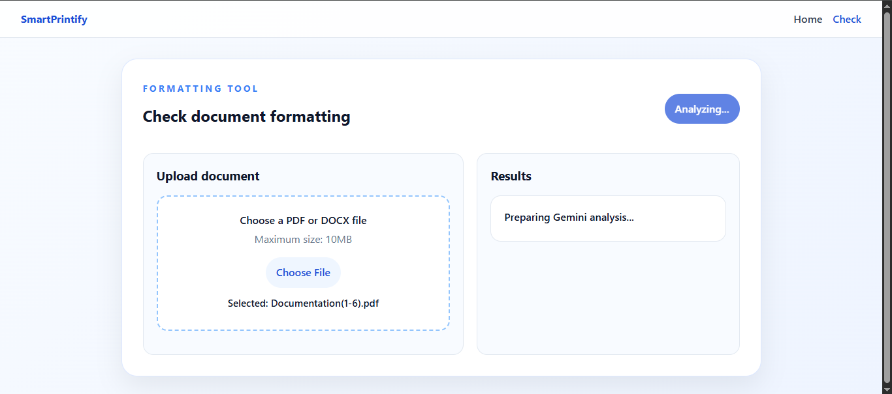
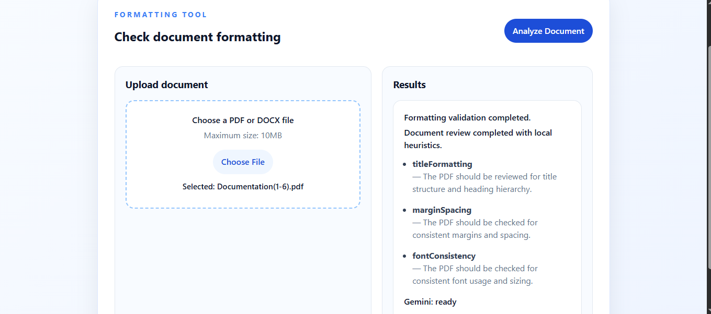

# SmartPrintify - AI-Powered Document Formatting Checker

<p align="center">

# 📄 SmartPrintify

### AI-Based Academic Document Formatting Validation System

</p>

---

## 🌟 Project Overview

**SmartPrintify** is an AI-powered document formatting validation application that helps students check and improve the formatting quality of their academic documents before submission.

The application allows users to upload their documents and uses **Google Gemini AI** to analyze formatting-related issues and provide intelligent suggestions.

SmartPrintify focuses on reducing manual document checking time and helping students prepare professional academic documentation.

---

# 🎯 Problem Statement

Students commonly face formatting problems while preparing academic documents such as:

- Final Year Project (FYP) reports
- Research papers
- Assignments
- University documentation

Common issues include:

- Incorrect formatting styles
- Inconsistent document structure
- Missing formatting requirements
- Manual checking difficulties
- Repeated revisions before submission

Traditional checking methods require teachers or students to manually review documents, which consumes significant time.

SmartPrintify solves this problem by providing an **AI-powered automated formatting validation system**.

---

# 👥 Target Users

SmartPrintify is designed for:

- University students
- Final Year Project students
- Researchers
- Teachers and reviewers

---

# 🚀 Live Deployment

## 🌐 Live Application

[Open SmartPrintify Live Application](https://smart-printify.vercel.app/)


---

# ✨ Features

## 📤 Document Upload

- Upload academic documents for analysis
- Simple and user-friendly upload interface
- Supports document-based formatting validation workflow


## 🤖 AI-Powered Document Analysis

- Uses Google Gemini AI for document analysis
- Automatically reviews formatting requirements
- Generates meaningful validation feedback


## ✅ Formatting Validation

The system analyzes:

- Document structure
- Heading organization
- Formatting consistency
- Academic documentation requirements
- Possible formatting issues


## 📊 AI Validation Results

Users receive:

- Formatting analysis response
- Detected issues
- Improvement suggestions
- AI-generated recommendations


## ⚡ User Experience

- Clean and professional interface
- Loading state during document analysis
- Error handling
- Responsive design

---

# 🤖 AI Feature

## Google Gemini AI Integration

SmartPrintify uses the **Google Gemini AI model** to analyze uploaded documents and generate formatting validation results.

The Gemini API is integrated securely through the backend using environment variables.

The API key is never exposed on the frontend.

---

# 🔧 Tools, Services & AI Models Used

SmartPrintify was developed using modern web development tools, AI services, and cloud platforms.

| Tool / Service | Purpose | Link |
|---|---|---|
| ChatGPT | AI assistance, project planning, debugging, and documentation | https://chatgpt.com |
| GitHub Copilot | AI-powered coding assistance inside VS Code | https://github.com/features/copilot |
| Google AI Studio | Creating and managing Gemini API access | https://aistudio.google.com |
| Google Gemini AI | AI model used for document formatting analysis | https://ai.google.dev |
| Google Stitch | UI/UX design generation and prototyping | https://stitch.withgoogle.com |
| Visual Studio Code | Source code development environment | https://code.visualstudio.com |
| GitHub | Version control and repository hosting | https://github.com |
| Vercel | Frontend deployment platform | https://vercel.com |
| Railway | Backend deployment platform | https://railway.app |

---

# 📸 Application Screenshots

The following screenshots demonstrate SmartPrintify's AI-powered document formatting workflow.

## 🏠 Home Page



---

## 📄 Formatting Check Interface



---

## 🔍 Document Analyzing Process



---

## 🤖 Gemini AI Validation Response



---

# ⚙️ How To Run The Project

## Installation & Setup

Clone the repository:

```bash
git clone YOUR_GITHUB_REPOSITORY_URL
cd SmartPrintify

# Frontend Setup
cd client
npm install
npm run dev

# Backend Setup (Open another terminal)
cd ../server
npm install

# Create .env file inside server folder
# Add:
PORT=5000
GEMINI_API_KEY=your_api_key

npm run dev